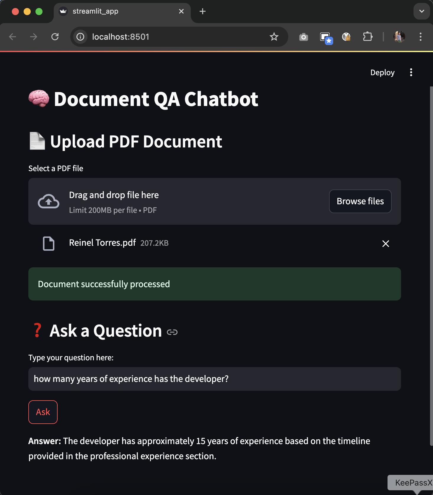

# 🧠 Document QA Chatbot (RAG)
Ask questions about your PDFs using RAG + LLMs (OpenAI or Hugging Face).

---

This project implements a **RAG (Retrieval-Augmented Generation) based chatbot** that allows you to upload PDF documents, index them with embeddings, and ask questions about their content. It supports both **OpenAI** and **Hugging Face models via the Inference API**.

## 🚀 Used Technologies

- **FastAPI**: API backend  
- **Streamlit**: Visual interface  
- **LangChain**: RAG orchestration  
- **FAISS**: Vector store for indexing  
- **OpenAI / HuggingFace**: Embeddings and LLM  
  - **Embeddings**: `sentence-transformers/all-MiniLM-L6-v2`  
  - **LLM (Hugging Face Inference API)**: `mistralai/Mixtral-8x7B-Instruct-v0.1`  
- **PyPDF**: PDF document processing

---

## ⚙️ Installation

```bash
git clone https://github.com/tu-usuario/rag-chatbot-documents.git
cd rag-chatbot-documents
python -m venv venv
source venv/bin/activate  # or venv\Scripts\activate on Windows
pip install -r requirements.txt
```

---

## 🔐 Configuration

Edit the file `.env`:

```env
USE_OPENAI=true
OPENAI_API_KEY=sk-your-key
HUGGINGFACEHUB_API_TOKEN=huggingface-api-token
```

If you prefer to use local embeddings, change `USE_OPENAI=false`.

---

## 🧪 Usage

### 1. Backend API execution
```bash
uvicorn app.main:app --reload
```

### 2. Execute the Streamlit interface (in another terminal)
```bash
streamlit run app/streamlit_app.py
```

---

## 🖼️ Screenshots

### 💬 Asking a question about the document


---

## 📂 Project Structure

```
app/
├── core/             # Pipeline RAG logic
├── main.py           # FastAPI app
├── streamlit_app.py  # User interface
data/
├── uploads/          # Uploaded PDF documents
├── vectorstore/      # FAISS index files
```

[](https://github.com/reinelt88)